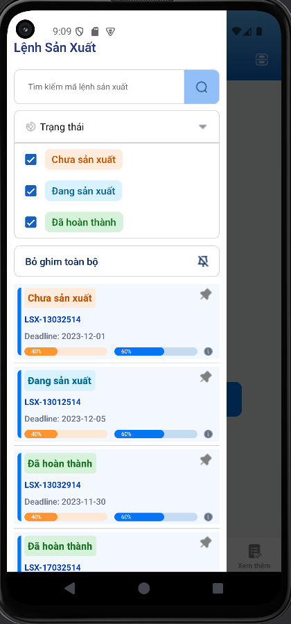

# FOSO MRP 👋


## Get Started

Bắt đầu dự án React Native với Expo

1. **Cài dặt npm**
   ```bash
   npm install
   ```
2. **Chạy dự án**
   ```bash
   npx expo start
   ```

## Cài đặt các thư viện bổ xung

```bash
npm install @react-navigation/bottom-tabs expo-checkbox expo-linear-gradient react-native-animatable react-native-modal
```

## Cấu trúc dự án

```
FOSO-MRP/
│-- app/
│   │-- _layout.tsx    
│
│-- assets/
|   |--fonts/
|   |--images/                 
│-- screen/
│   │-- homescreen/
│   │   │-- components/
│   │   │   │-- Header.tsx
│   │   │   │-- ItemData.tsx
│   │   │   │-- LeftModal.tsx
│   │   │-- HomeScreen.tsx
│   │-- Diagram.tsx
│   │-- List.tsx
│   │-- Order.tsx
│   │-- ShowMore.tsx
│   │-- Total.tsx
│-- dataMock.ts       
│-- useData.ts        
│-- package.json      
│-- tsconfig.json    
```

## Một số Dependencies trong dự án

```json
"dependencies": {
  "@react-navigation/bottom-tabs": "^7.3.3",
  "expo-checkbox": "~4.0.1",
  "expo-linear-gradient": "~14.0.2",
  "react-native-animatable": "^1.4.0",
  "react-native-modal": "^14.0.0-rc.1"
}
```

## Các thư viện quan trọng

- **@react-navigation/bottom-tabs**: Xử lý điều hướng BottomTab.
- **expo-checkbox**: Thành phần Checkbox cho React Native.
- **expo-linear-gradient**: Cho phép hiệu ứng gradient.
- **react-native-animatable**: Tạo animation cho mượt app.
- **react-native-modal**: Tạo modal.

## Tối ưu hóa hiệu xuất
Sử dụng Hooks
- **useState**: Quản lý trạng thái của component
- **useEffect**: Xử lí cập nhập lại dữ liệu
- **useMemo**: Tối ưu hóa tính hóa, rerender UI khi có mảng data size lớn
Sử dụng Animation : Tích hợp vào buttons, views, tăng trải nghiệm người dùng

### Ví dụ về sử dụng Hook `useMemo`

```typescript
const filteredData = useMemo(() => {
  return data.filter(item => item.active);
}, [data]);
```

## Screenshots


