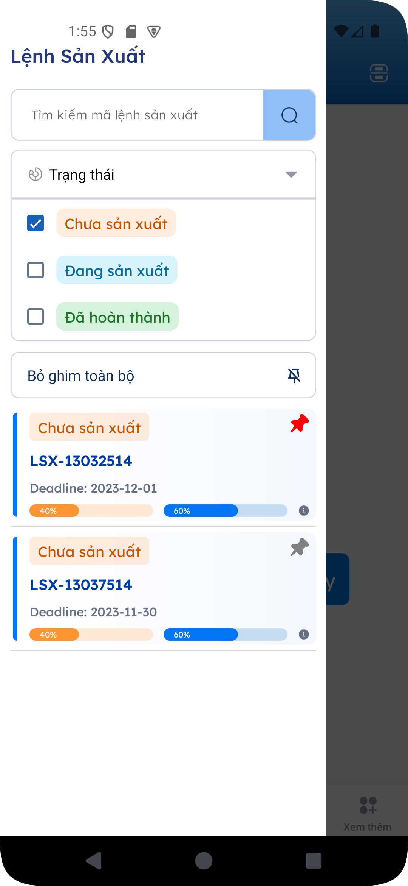

# FOSO MRP 👋


## Get Started

To get started with the Expo app, follow these steps:

1. **Install Dependencies**
   ```bash
   npm install
   ```
2. **Start the App**
   ```bash
   npx expo start
   ```
   In the output, you'll find options to open the app in a:

   - [Development Build](https://docs.expo.dev/develop/development-builds/introduction/)
   - [Android Emulator](https://docs.expo.dev/workflow/android-studio-emulator/)
   - [iOS Simulator](https://docs.expo.dev/workflow/ios-simulator/)
   - [Expo Go](https://expo.dev/go), a limited sandbox for trying out app development with Expo

You can start developing by editing the files inside the **app** directory. This project uses [file-based routing](https://docs.expo.dev/router/introduction).

## Installing Additional Libraries

```bash
npm install @react-navigation/bottom-tabs expo-checkbox expo-linear-gradient react-native-animatable react-native-modal
```

## Project Structure

```
FOSO-MRP/
│-- app/
│   │-- _layout.tsx    # Handles Bottom Tab Navigation
│
│-- assets/            # Contains fonts, images
│-- screen/
│   │-- homescreen/
│   │   │-- components/
│   │   │   │-- Header.tsx
│   │   │   │-- ItemData.tsx
│   │   │   │-- LeftModal.tsx
│   │   │-- HomeScreen.tsx
│   │-- Diagram.tsx
│   │-- List.tsx
│   │-- Order.tsx
│   │-- ShowMore.tsx
│   │-- Total.tsx
│-- dataMock.ts        # Mock data
│-- useData.ts         # Hook for handling data
│-- package.json       # Dependency list
│-- tsconfig.json      # TypeScript configuration
```

## Installed Dependencies

The following dependencies are included in the project:

```json
"dependencies": {
  "@react-navigation/bottom-tabs": "^7.3.3",
  "expo-checkbox": "~4.0.1",
  "expo-linear-gradient": "~14.0.2",
  "react-native-animatable": "^1.4.0",
  "react-native-modal": "^14.0.0-rc.1"
}
```

## Key Libraries

- **@react-navigation/bottom-tabs**: Handles Bottom Tab Navigation.
- **expo-checkbox**: Checkbox component for React Native.
- **expo-linear-gradient**: Enables gradient effects.
- **react-native-animatable**: Provides smooth animations.
- **react-native-modal**: Creates modals easily.

## Performance Optimization with Hooks

This project optimizes rendering using React hooks:

- **useState**: Manages component state.
- **useEffect**: Handles side effects like API calls.
- **useMemo**: Prevents unnecessary recalculations.

### Example Optimization Using `useMemo`

```typescript
const filteredData = useMemo(() => {
  return data.filter(item => item.active);
}, [data]);
```

## Research

- [Expo Documentation](https://docs.expo.dev/more/create-expo/)
- [Bottom Tab Navigator](https://reactnavigation.org/docs/bottom-tab-navigator/)
- [React Native Modal](https://www.npmjs.com/package/react-native-modal)

## Screenshots


